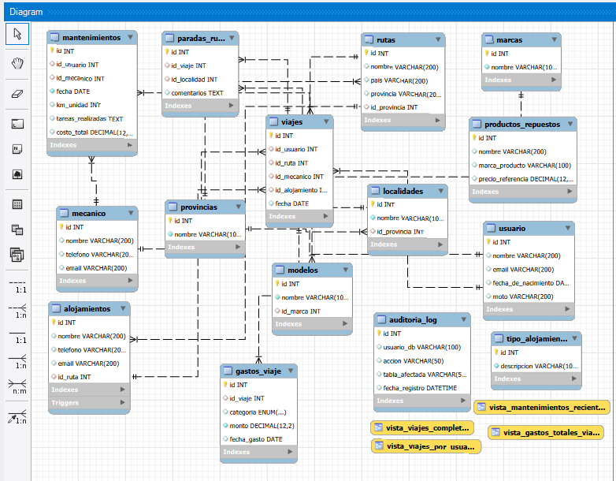

# MotoApp: Gestión Integral de Viajes y Mantenimiento

## 1. Introducción
**MotoApp** es un ecosistema digital diseñado para centralizar la experiencia del motociclista en Argentina. El proyecto surge de la necesidad de transformar el registro informal de viajes y mantenimientos en una estructura de datos relacional robusta. Utilizando **MySQL**, esta plataforma integra la logística de rutas nacionales con el seguimiento técnico de los vehículos, permitiendo a los usuarios tomar decisiones basadas en el historial de su unidad y en métricas reales de consumo.

## 2. Objetivo
El sistema busca cubrir tres aristas fundamentales del "Touring" y el uso cotidiano de motocicletas:
* **Estandarización Logística:** Crear un inventario dinámico de rutas argentinas, categorizadas por dificultad y geolocalización (Provincias/Localidades), facilitando la elección de destinos según la experiencia del piloto.
* **Trazabilidad Mecánica:** Proveer un libro de servicio digital donde se registren intervenciones, repuestos utilizados y costos, garantizando la seguridad activa del vehículo y su valor de reventa.
* **Inteligencia de Gastos (BI):** Implementar una tabla de hechos que registre cada movimiento económico (nafta, peajes, servicios), permitiendo proyectar presupuestos precisos para futuras travesías.

## 3. Situación Problemática
En la actualidad, el motociclista promedio padece de **fragmentación de información**:
1. **Riesgo de Seguridad:** El mantenimiento preventivo suele depender de la memoria del usuario o de etiquetas físicas que se deterioran, lo que deriva en fallas mecánicas evitables.
2. **Opacidad Financiera:** Al no existir un registro centralizado de gastos incidentales, es imposible determinar el costo operativo real por kilómetro de diferentes modelos de motos.
3. **Desconexión con Prestadores:** La dificultad para encontrar mecánicos o alojamientos especializados "moto-friendly" en zonas remotas genera una logística ineficiente y mayor riesgo ante imprevistos.

## 4. Modelo de Negocio
MotoApp se posiciona como una plataforma **B2B2C** con las siguientes verticales de valor:
* **Riders (Core Users):** Usuarios que alimentan el sistema con registros de viajes y consumos, obteniendo a cambio reportes de estado y costos.
* **Talleres y Especialistas:** Entidades que pueden ser rankeadas y consultadas según la especialidad requerida por la marca y modelo de la moto.
* **Sector Turístico:** Alojamientos que pueden optimizar su oferta basándose en las rutas más transitadas y las preferencias de parada de los motociclistas.
* **Monetización de Datos:** El volumen de información sobre el desgaste de repuestos y consumo de combustible genera insights valiosos para marcas del sector automotriz y aseguradoras.

## 5. Diagrama Entidad-Relación (E-R)
El diseño se basa en una arquitectura de **15 tablas** que garantiza la **Tercera Forma Normal (3FN)**, evitando redundancias y asegurando la integridad referencial. 

*(Asegúrate de subir tu archivo con este nombre exacto para que se visualice aquí)*
